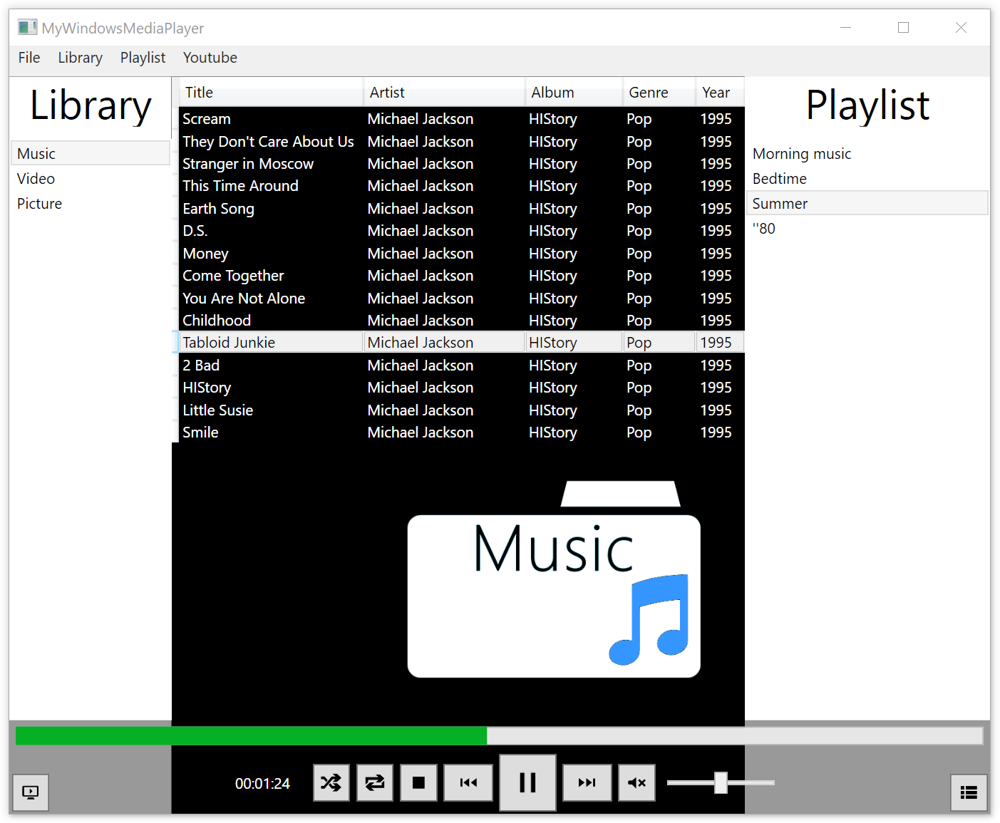
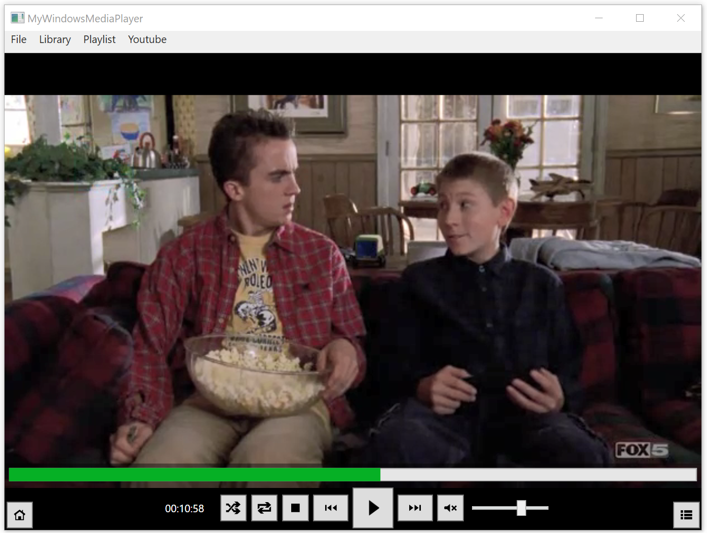

# My Windows Media Player [](https://travis-ci.org/kortescode/My-Windows-Media-Player)
 
My Windows Media Player is a C# executable (Exe). It's a tiny media player and media library application.



## Requirements

Building the My Windows Media Player executable requires the following tool:
- Microsoft .NET Framework 4 (see [Web Installer](https://www.microsoft.com/en-us/download/details.aspx?id=17851))

## Compilation

To build the executable, use:
```bash
C:\Windows\Microsoft.NET\Framework\[VERSION]\MSBuild.exe MyWindowsMediaPlayer.sln /p:Configuration=Release
```

## Usage

To launch the executable, use:
```bash
 cd MyWindowsMediaPlayer\bin\Release\
 MyWindowsMediaPlayer.exe
```


### Menu

#### File

- Add File: add a file into the current media library
- Add Stream: add a stream file into the current media library
 
#### Library

- Reorganize: reorganize automatically the current media library (add files from path / remove missing files)
- Path Manager: add or remvove paths used by the media explorer system

#### Playlist

- New Playlist: add a new playlist

#### Youtube

- Show/Hide Youtube: show or hide a Youtube window

### Media libraries

The media libraries are stored in the [`Config/`](MyWindowsMediaPlayer/Config/) folder :
- [`paths.xml`](MyWindowsMediaPlayer/Config/paths.xml)
- [`playlists.xml`](MyWindowsMediaPlayer/Config/playlists.xml)
- [`musics.xml`](MyWindowsMediaPlayer/Config/musics.xml)
- [`videos.xml`](MyWindowsMediaPlayer/Config/videos.xml)
- [`pictures.xml`](MyWindowsMediaPlayer/Config/pictures.xml)

## License

Distributed under the [Apache License, Version 2.0](http://www.apache.org/licenses/). See [`LICENSE`](LICENSE) for more information.
